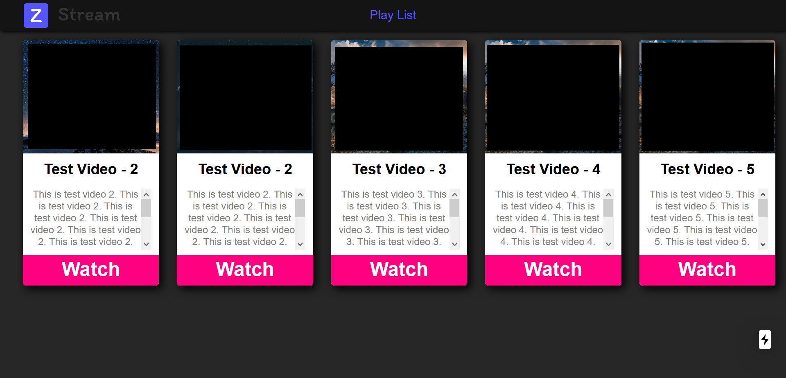
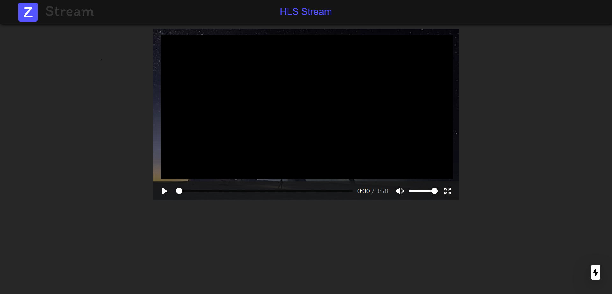

# Stream client

## Introduction

Now only support HLS(HTTP Live Streaming)  

## Start

```shell
# dev run
$ npm run dev

# build
$ npm run build

# start from build
$ npm run start

# export
$ npm run export
$ cd out
$ serve -p 8080
```

## Demo

  
  

## Reference

logo from [logohub.io](https://logohub.io/#)